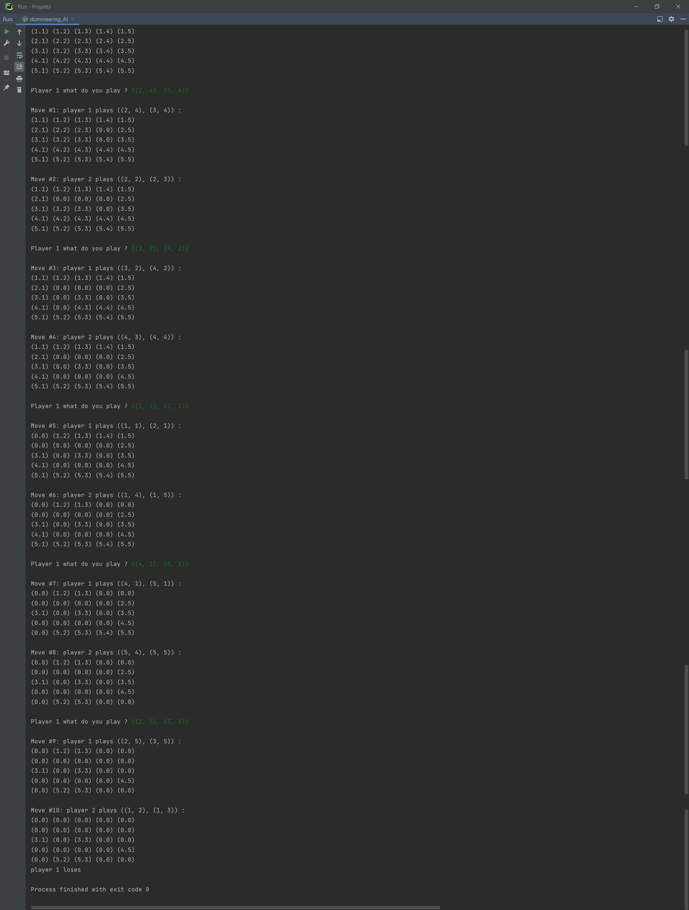

## Domineering

#### Installation:
Assuming that you have pip installed, type this in a terminal: ```sudo pip install easyAI```

#### Rules:
Here are basic rules on how to play the Domineering game: two players take turns to place lines (tiles) on the board,
covering up fields. One cover two fields vertically, the other covers two fields horizontally. The first player who
cannot move (who cannot cover two fields in a specific way) loses.

#### Authors:
By Maciej Zagórski (s23575) and Łukasz Dawidowski (s22621), group 72c (10:15-11:45)

#### Sources:
https://www.byrdseed.com/domineering/ , https://en.wikipedia.org/wiki/Domineering (Domineering rules)  
https://zulko.github.io/easyAI/index.html , https://github.com/Zulko/easyAI (easyAI documentation)

#### Sample Gameplay:

