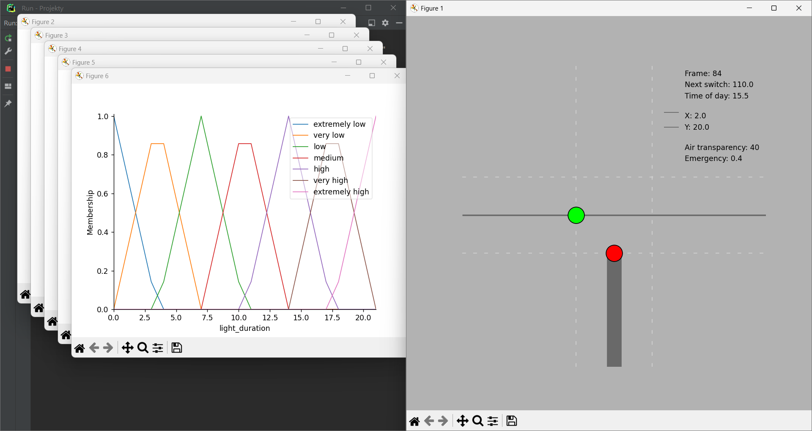

## Fuzzy Logic (Traffic Lights Simulation)

#### Installation:
Assuming that you have pip installed, type this in a terminal: ```sudo pip install scikit-fuzzy``` (with regard to the
mechanism implementing fuzzy logic) and ```sudo pip install matplotlib``` (with regard to the visualisation of the road
junction).

#### Overview:
This model shows how would traffic lights work based on few input variables like traffic density based on time of day,
car queuing at the intersection, air transparency or in other words road visibility (rain, fog etc.) and the presence
of an emergency situation.

In the code we provide variables, membership functions, and rules to define fuzzy logic which allow it to simulate the
control system of traffic lights – to determine the optimal green light duration.

#### Authors:
By Maciej Zagórski (s23575) and Łukasz Dawidowski (s22621), group 72c (10:15-11:45)

#### Sources: 
https://scikit-fuzzy.github.io/scikit-fuzzy/ , https://github.com/scikit-fuzzy (scikit-fuzzy documentation)
https://matplotlib.org/stable/ , https://github.com/matplotlib (matplotlib documentation)
_Application of fuzzy logic to control traffic signals_ (https://pubs.aip.org/aip/acp/article-pdf/doi/10.1063/1.5112230/14186507/020045_1_online.pdf)
https://github.com/woo-chia-wei/traffic-fuzzy-control/tree/master (example of applying the fuzzy logic to the road 
junction and the traffic fimulation)

#### Usage:
- Modify the input values for 'emergency', 'traffic_during_day', 'cars_queuing', and 'air_transparency' in the Animation
  class (the ranges of the mentioned parameters may be modified in the TrafficLightControlSystem).
- Run the code to compute the optimal 'light_duration'.
- Visualize the results using the plotted membership functions as well as the visualisation of the road junction and the
  real-life traffic simulation (click on the junction to run the animation).

