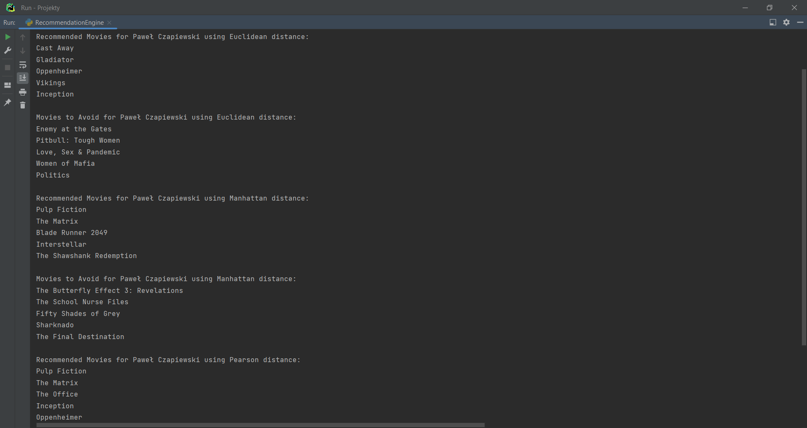
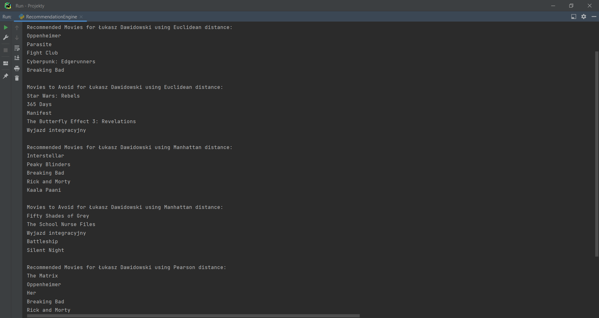
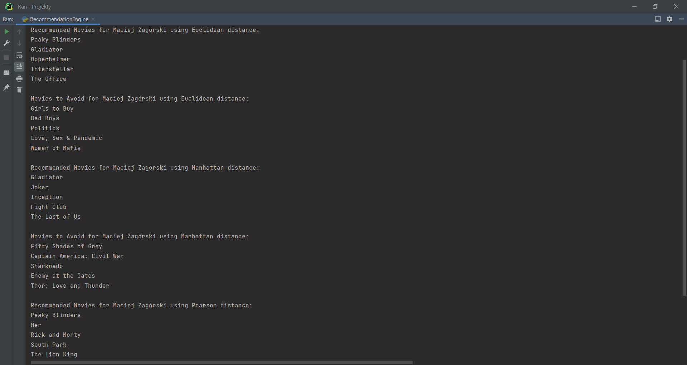

## Clustering (Movie Recommendation (and Anti-Recommendation) Engine)

#### Installation:
Assuming that you have pip installed, type this in a terminal: ```sudo pip install numpy``` (with regard to arrays and
math-like functions used in the code)

#### Overview:
This is a basic movie recommendation (and anti-recommendation) engine, providing 5 movies recommended to watch and 5
movies to avoid for a selected (target) user, based on the data given in JSON file (```film_data.json```). The engin uses
different distance metrics to find correlations between the film tastes of different people and their films ratings.

The distance metrics functions have been slightly modified, by adding „bonus” to them, in order to value more ratings of
people who rated more the same movies as the target user. If a particular person does not share any rated movie as the
target user, his/her rating will be considered as netrual (movies watched by this person films watched by that person
should not be regarded as either recommended or not recommended – it is not known).

#### Authors:
By Maciej Zagórski (s23575) and Łukasz Dawidowski (s22621), group 72c (10:15-11:45)

#### Sources: 
https://numpy.org/ (NumPy documentation)

#### Usage:
- Define the target user to recommend movies. The user must be defined in JSON file in order for code to work properly
  and must have defined some movie ratings.
- The distance metric may be chagned using „distance_metrics” parameter in the „recommend_movies” function; as for now,
  it is possible to chose between the Euclidean distance ('Euclidean'; the default value), the Manhattan distance
  ('Manhattan') and the Pearson's distance ('Pearson').
- Number of movies to recommend and to avoid can be changed by setting-up the „num_recommendations” parameter in
  the „recommend_movies” function (the defalut value is 5).



