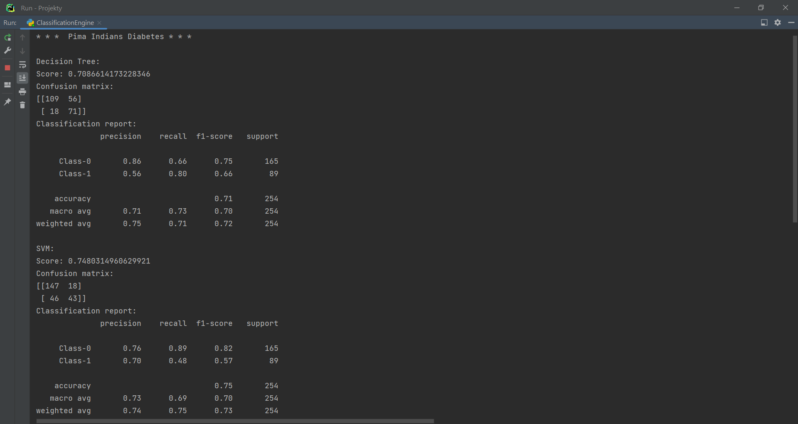
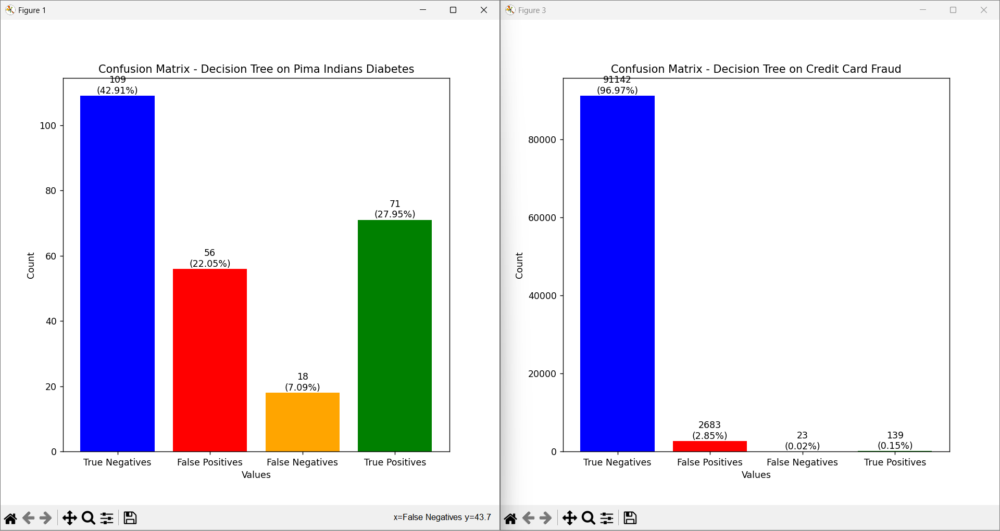
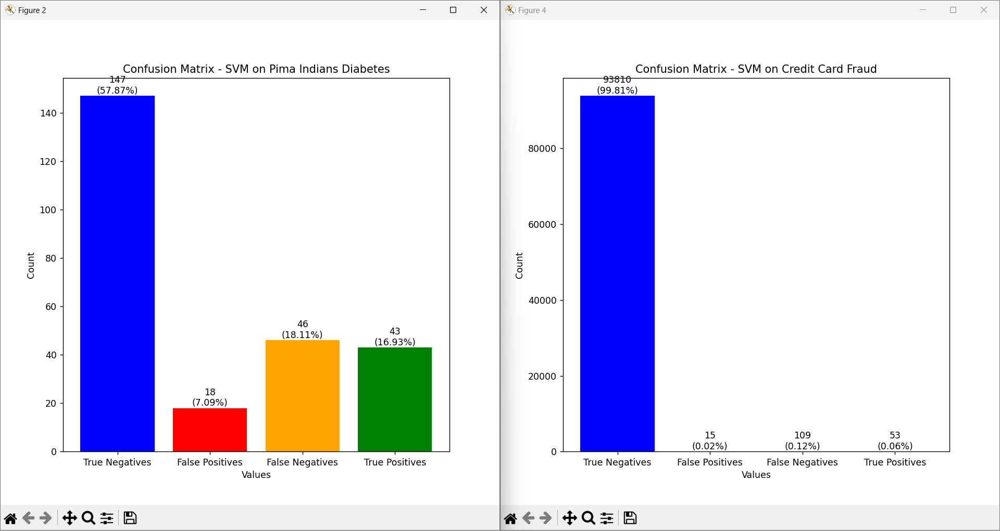

## Classification (Classification Engine)

#### Installation:
Assuming that you have pip installed, type this in a terminal: ```sudo pip install pandas``` (with regard to data
structures and data analysis functions used in the code), ```sudo pip install sklearn``` (with regard to classification
algorithms (classifiers) and related functions), and ```sudo pip install matplotlib``` (with regard to visualisation of
the program results).

#### Overview:
The Classification Engine that uses machine learning algorithms (classifiers) – decision tree and support vector
machines (SVM) – to determine output (0 or 1) based on the provided data (sets of features) stored in corresponding
.csv files. This program has been tested and used in respect of the following problems (datasets):

* the Pima Indians Diabetes problem – a dataset consisting of sets of medical data and information (output) whether a 
  specific person has or does not have diabetes,
* Credit Card Frauds problem – a dataset consisting of sets of features of credit card transactions and information
  (output) whether a specific transaction should be or should not be considered as a fraud.

The program returns results (metrics) with regard to each of the classifiers, i.e. information, how many the outputs
were predicted by the alogirthms correctly and how many incorrectly. Additionally, the visualisation of the confusion
matrix, using a bar chart, is displayed.

#### Authors:
By Maciej Zagórski (s23575) and Łukasz Dawidowski (s22621), group 72c (10:15-11:45)

#### Datasets: 
https://www.kaggle.com/datasets/uciml/pima-indians-diabetes-database (Pima Indians Diabetes dataset)

https://www.kaggle.com/datasets/mlg-ulb/creditcardfraud (Credit Card Fraud dataset)


#### Sources: 
https://pandas.pydata.org/docs/index.html (pandas documentation)

https://scikit-learn.org/stable/index.html (scikit-learn documentation)

https://matplotlib.org/stable/ (matplotlib documentation)

#### Screens:



