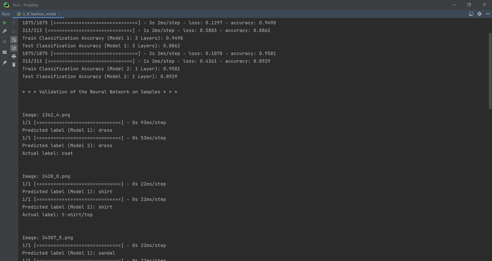

## Neural Networks

#### Installation:

Assuming that you have pip installed, type this in a terminal:  
```sudo pip install tensorflow``` (with regard to creating neural networks [“NN”] models),  
```sudo pip install sklearn``` (with regard to functions related to classification and measuring its results),  
```sudo pip install matplotlib``` (with regard to visualisation of classification results),  
```sudo pip install pandas``` (with regard to data structures and data analysis functions used in the code),  
and ```sudo pip install numpy``` (with regard to arrays and math-like functions used in the code)

#### Overview:

Four programs made to create NN models and apply them to four different problems. These problems (datasets)
are as follows:

* Credit Card Fraud problem – a dataset consisting of sets of features of credit card transactions (input) and
  information whether a specific transaction should be or should not be considered as a fraud (output);
* CIFAR-10 - a dataset consisting of sets of 3-layers(RGB) 32 x 32 px photos of animals and vehicles (input) grouped
  into 10 categories (output);
* Fashion MNIST - a dataset consisting of greyscale 28 x 28 px photos of different clothes (input) grouped into 10
  categories (output);
* Self-made dataset of all pairs of numbers from 0 to 1024, presented in binary notation (input), together with the
  results of comparison of those numbers, within each of the pairs (output).

The NN models were created using TensorFlow framework. They are capable (more or less accurately) to solve the
problems listed above, i.e. to predict outcome (specific label) based on the input data. The input date may take
different form, depending on the problem (respectively): raw date (float numbers), color or greyscal pictures of
different sizes or binary tables.

The results of applying the NN model with regard to the Credit Card Fraud problem **were compared with the results of
classification made using decision tree and support vector machines (SVM) algorithms** (classifiers). The results of
this comparison were presented in one of the screenshots below. The decision tree classifier provided the most accurate
result.

The results of applying the NN model with regard to the CIFAR-10 dataset were also presented **in the form of confusion
matrix (heatmap;** please see the screenshots below).

With regard to the Fashion MNIST dataset, **two different models of NN were created:** the “deeper” model, with three
hidden layers (with 128 neurons each) and the “wider” one, with one hidden layer (with 384 neurons). The wider model,
with only one layer, was slightly more accurate than the deeper one.

The fourth problem was prepared more as an exercise, to check whether it is possible to teach NN model a specific
function, in this case: comparing two numbers (the NN model acting as a comparator). The numbers to compare (two inputs)
are provided to the model in the binary notation, the form of a list of 0s and 1s. In order to teach the model, **a
self-made dataset of all pairs of numbers from 0 to 1024 (2^10), presented in binary notation, were prepared.** Then,
the model was applied to compare the random numbers from 1,000,000,000,000 to 1,267,650,600,228,229,401,496,703,205,376
(2^100). Thus, the training dataset contains numbers from 0 to 1024 (2^10) with complimentary 0s (to match the size of a
2^100 number).

#### Authors:

By Maciej Zagórski (s23575) and Łukasz Dawidowski (s22621), group 72c (10:15-11:45)

#### Datasets:

The following datasets were used:  
https://www.kaggle.com/datasets/mlg-ulb/creditcardfraud (Credit Card Fraud dataset)  
https://www.cs.toronto.edu/~kriz/cifar.html , https://www.tensorflow.org/datasets/catalog/cifar10 (CIFAR-10 dataset)  
https://github.com/zalandoresearch/fashion-mnist , https://www.tensorflow.org/datasets/catalog/fashion_mnist (Fashion
MNIST dataset)  
Self-made dataset of all pairs of numbers from 0 to 1024, presented in binary notation

#### Sources:

https://www.tensorflow.org/guide?hl=pl (TensorFlow documentation)  
https://scikit-learn.org/stable/index.html (scikit-learn documentation)  
https://matplotlib.org/stable/ (matplotlib documentation)  
https://numpy.org/doc/stable/ (NumPy documentation)
https://pandas.pydata.org/docs/ (pandas documentation)

#### Screens:

Credit Card Fraud Detection using TensorFlow Neural Network Model  
  
CIFAR-10 Image Classification using TensorFlow Neural Network Model  
  
  
Fashion MNIST Image Classification using TensorFlow Neural Network Models  
  
Comparison of Binary Numbers using TensorFlow Neural Network Models  
  