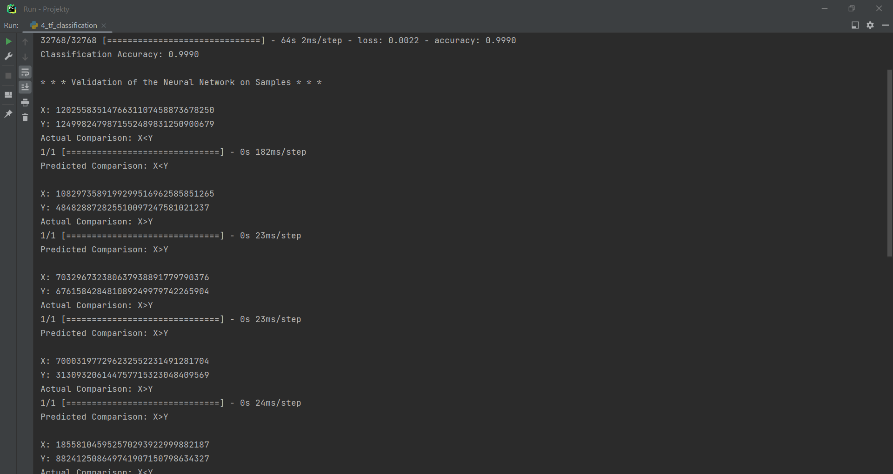

## Neural Networks

#### Installation:
Assuming that you have pip installed, type this in a terminal: ```sudo pip install tensorflow``` (with regard to 
creating neural networks model to train on datasets), ```sudo pip install sklearn``` (with regard to classification
algorithms (classifiers) and related functions), ```sudo pip install matplotlib``` (with regard to visualisation of
the program results), and ```sudo pip install numpy``` (with regard to arrays and math-like functions used in the code)

#### Overview:
4 programs made to create neural network model on 4 different problems. Neural networks models made with this
problem are more or less capable to predict outcome based on raw data (later normalized), color and greyscale
photos of different size. For CIFAR-10 dataset there is generated heat map and for Fashion MNIST there are 2 different 
size neural networks comparison.This programs has been tested and used in respect of the following problems (datasets):

* Credit Card Frauds problem – a dataset consisting of sets of features of credit card transactions and information
  (output) whether a specific transaction should be or should not be considered as a fraud.
* CIFAR-10 - a dataset consisting of sets of 3 layers(RGB) 32x32px photos of animals and vehicles based on 10 categories
* Fashion MNIST - a dataset consisting of greyscale 28x28px photos of different clothes based on 10 categories
* Self-made dataset of numbers 0-1024 normalized to binary

#### Authors:
By Maciej Zagórski (s23575) and Łukasz Dawidowski (s22621), group 72c (10:15-11:45)

#### Datasets: 
https://www.kaggle.com/datasets/mlg-ulb/creditcardfraud (Credit Card Fraud dataset)

https://www.cs.toronto.edu/~kriz/cifar.html (CIFAR-10 dataset)

https://www.kaggle.com/datasets/zalando-research/fashionmnist (Fashion MNIST dataset)

Self-made dataset of numbers 0-1024 normalized to binary

#### Sources: 
https://www.tensorflow.org/guide?hl=pl (tensorflow documentation)

https://scikit-learn.org/stable/index.html (scikit-learn documentation)

https://matplotlib.org/stable/ (matplotlib documentation)

#### Screens:


