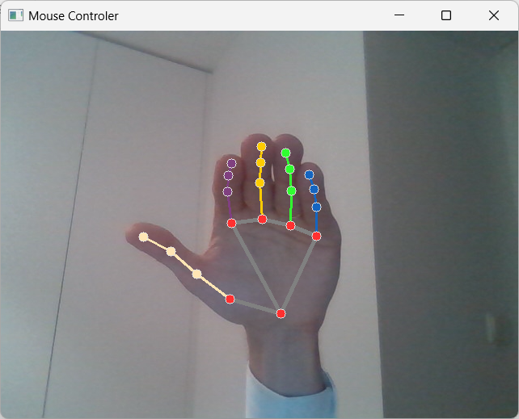

## Neural Networks

#### Installation:

Assuming that you have pip installed, type this in a terminal:  
```sudo pip install tensorflow``` (with regard to creating neural networks [“NN”] models),  
```sudo pip install opencv-python``` (with regard of working with camera video),  
```sudo pip install mediapipe``` (with regard to work with created detection models (hand landmark detection)),  
and ```sudo pip install pyautogui``` (with regard to work with system elements (mouse, keyboard etc.)) 


#### Overview:

A program using hand landmark detection in order to move in cursor and do basic tasks.

It was made with a though about controlling the browser so there are specific gestures to work your way in browsers 
control you can find those gestures in Screens section or on provided sample videos


#### Authors:

By Maciej Zagórski (s23575) and Łukasz Dawidowski (s22621), group 72c (10:15-11:45)

#### Sources:

https://www.tensorflow.org/guide?hl=pl (TensorFlow documentation)
https://docs.opencv.org/4.x/ (OpenCV documentation)
https://developers.google.com/mediapipe/solutions/vision/hand_landmarker (Mediapipe hand landmark detection 
documentation)
https://pyautogui.readthedocs.io/en/latest/ (PyAutoGUI documentation)

#### Screens:

Gesture for scrolling up (Scroll UP)
  
Gesture for scrolling down (Scroll DOWN)
  
Gesture for moving cursor
  
Gesture for left mouse button click (LMB) 
  
Gesture to change to next Browser Tab (Ctrl + Tab)
  