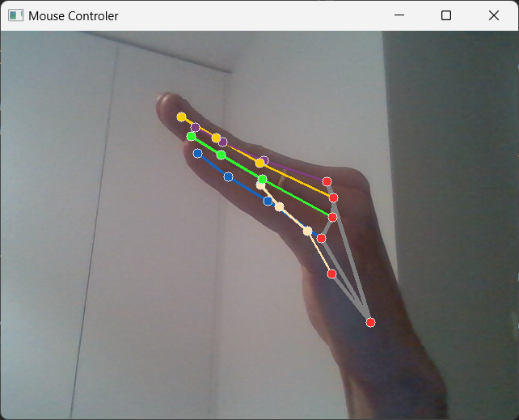

## Neural Networks

#### Installation:

Assuming that you have pip installed, type this in a terminal:  
* ```sudo pip install tensorflow``` (with regard to creating neural networks [“NN”] models),  
* ```sudo pip install opencv-python``` (with regard of working with camera video),  
* ```sudo pip install mediapipe``` (with regard to work with created detection models (hand landmark detection)),  
* ```sudo pip install pyautogui``` (with regard to work with system elements (mouse, keyboard etc.)) 


#### Overview:

A program using hand landmark detection library to move a cursor on a screen and do basic tasks. It was made with a
though about controlling the browser, so specific gestures were designed to use the browser (scrolling up and down,
changing tabs, moving the cursor and “left-clicking”). You can find presentation of those gestures in the _Screens_
section below, on pictures and the provided sample videos.

#### Authors:

By Maciej Zagórski (s23575) and Łukasz Dawidowski (s22621), group 72c (10:15-11:45)

#### Sources:

https://www.tensorflow.org/guide?hl=pl (TensorFlow documentation)
https://docs.opencv.org/4.x/ (OpenCV documentation)
https://developers.google.com/mediapipe/solutions/vision/hand_landmarker (Mediapipe hand landmark detection 
documentation)
https://pyautogui.readthedocs.io/en/latest/ (PyAutoGUI documentation)

#### Screens:

Gesture for scrolling up (Scroll UP):  
  
Gesture for scrolling down (Scroll DOWN):  
  
Gesture to change to next Browser Tab (Ctrl + Tab):  
  
Gesture for moving cursor:  
  
Gesture for left mouse button click (LMB):  
  
Scrolling and changing tabs:  
[](https://youtu.be/TPRT-t14pi0)  
Moving cursor and clicking:  
[](https://youtu.be/jLubnVmyucY)