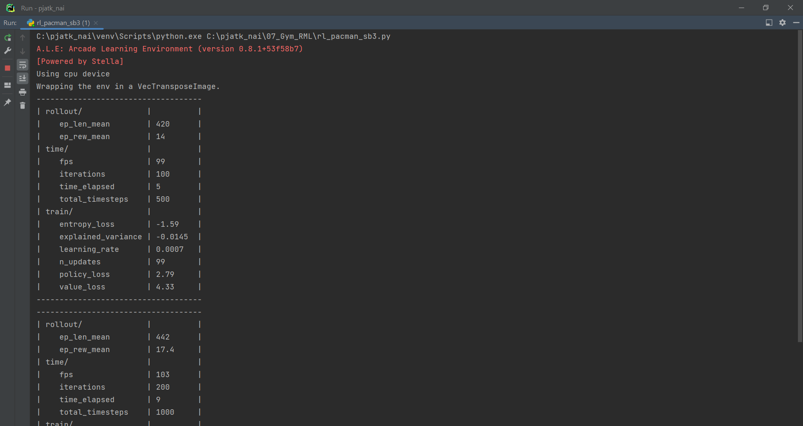

## Reinforcement Learning

#### Installation:

Assuming that you have pip installed, type this in a terminal:  
* ```sudo pip install stable-baselines3``` (with regard to creating reinforcement learning [“RL”] models),  
* ```sudo pip install gymnasium[accept-rom-license]``` (with regard to Atari environments, used to teach RL models) 

#### Overview:

A simple program using _Stable Baselines3_ – a set of reliable implementations of RL algorithms – to create AI models
(agents) able to play in one of the classic Atari games, i.e. _Pacman_ in this case. You can find presentations of
(videos with) the application of the developed agents in the game below. The agents were created using the following
algorithms and using CNN policies (https://stable-baselines.readthedocs.io/en/master/modules/policies.html):
* A2C – synchronous, deterministic variant of Asynchronous Advantage Actor Critic (A3C):
https://stable-baselines3.readthedocs.io/en/master/modules/a2c.html
* DQN – Deep Q Network: https://stable-baselines3.readthedocs.io/en/master/modules/dqn.html
* PPO – Proximal Policy Optimization: https://stable-baselines3.readthedocs.io/en/master/modules/ppo.html  

An attempt was also made to create models using the _TensorFlow_ library and _Keras_ API, but this ended in failure
(because of the problems resulting from the libraries versions and their compatibility). Therefore, it was decided to
use _Stable Baselines3_ instead.

#### Authors:

By Maciej Zagórski (s23575) and Łukasz Dawidowski (s22621), group 72c (10:15-11:45)

#### Sources:

https://stable-baselines3.readthedocs.io/ (Stable-Baselines3 documentation)
https://gymnasium.farama.org/ (Gymnasium documentation)

#### Screens:

Learning process:  
  
A2C agent:  
[](https://youtu.be/FeNNz-DpeMw)  
DQN agent:  
[](https://youtu.be/_LJ_UMJsfpA)  
PPO agent:  
[](https://youtu.be/uZ8pHCQOyCs)